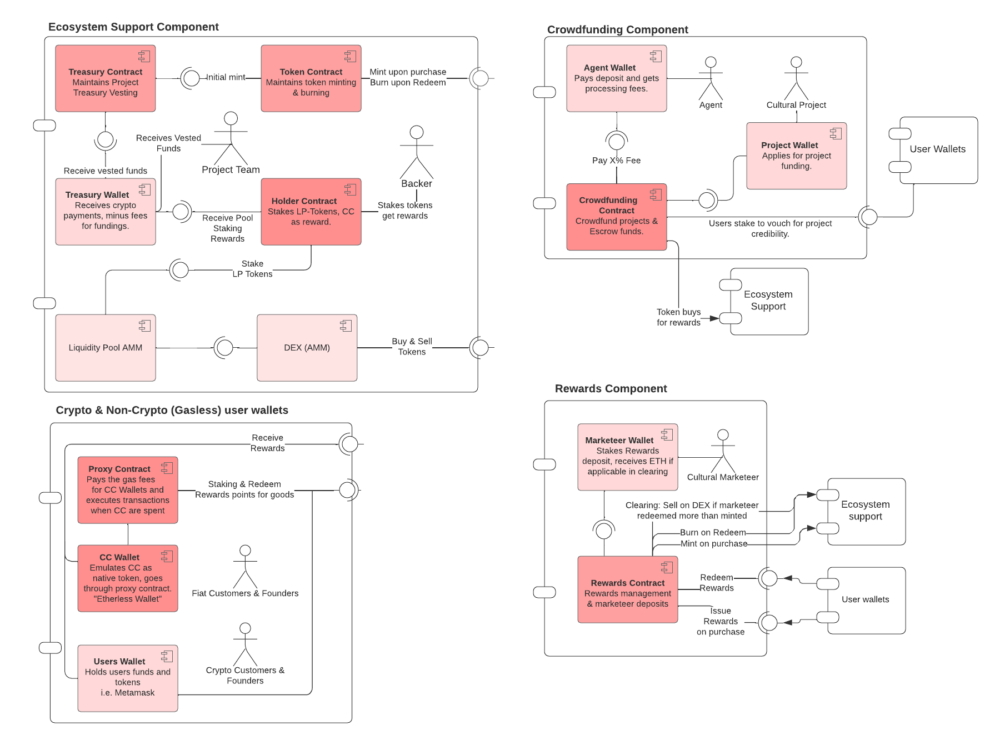

# The CPTC Ecosystem Smart Contracts
The CPTC Ecosystem is providing functionalities for cultural institutions:

- Reward users for purchasing tickets, audio tours, NFTs and more.
- Crowdfunding for cultural institutions
- NFT Ticket sales.

The ecosystem is designed to be flexible and expandable.

## System Components Overview

## Current Contracts
| Contract        | Description                             | Status        | Source             |
|-----------------|-----------------------------------------|---------------| -------------------|
| [CPTC Token](cptcToken.md) | The ERC 20 Token Contract | AUDIT | [cptcToken.sol](../polygon/contracts/cptcToken.sol) |
| [Hub Contract](CptcHub.md) | Global Settings, Permissions and Addresses | AUDIT | [CptcHub.sol](../polygon/contracts/CptcHub.sol) |
| [Migrations](Migrations.md) | Migrations Contract Required for truffle. | AUDIT | [Migrations.sol](../polygon/contracts/Migrations.sol) |
| [Owner](Owner.md) | Replaced by OpenZepplin | DEPRECATED | [Owner.sol](../polygon/contracts/Owner.sol) |
| [Rewards](Rewards.md) | Handling the rewards | DESIGN | N/A |

## Permissions & Roles
| Val  | Description                                              |
|----- |----------------------------------------------------------|
|  0x1 | Allowed to mint. |
|  0x2 | Allowed to burn. |
|  0x3 | Allowed to mint and burn. |
